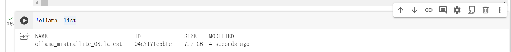
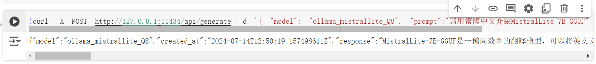

# Ollama Hugging Face MistralLite

Using ollama with custom Model From HuggingFace MistralLite for **traditional chinese chatting**. I run the command in a Colab .ipynb file, but you can choose the environment that suits you.  


## Overview

- Application: Ollama v0.2.5
- Model: MistralLite-7B-GGUF mistrallite.Q8_0.gguf


## Architecture
```
ollama-hugging-face-mistralLite-python/
├── ollama_mistrallite_q8.py
├── Modelfile
└── downloads/
    └── mistrallite.Q8_0.gguf
```

## Results

### Adding Model Into Ollama


### Api Example  
```
>> 請用繁體中文介紹MistralLite-7B-GGUF 
>> MistralLite-7B-GGUF是一種高效率的翻譯模型，可以將英文文本轉換為繁體中文。它使用了由Hugging Face開發的Transformer架構，並且培訓在大量的英文和繁體中文資料上，使其能夠產生高品質的翻譯結果。
```
